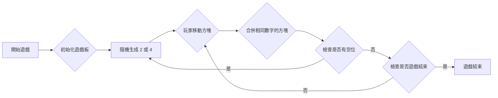
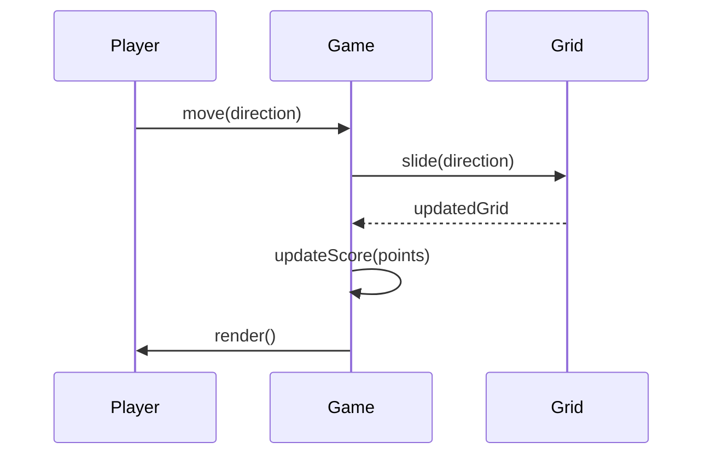

# 2048 遊戲規格文件

## 1. 概述

本文檔描述了 2048 遊戲的規格，包括遊戲流程、資料模型和系統架構。

## 2. 遊戲流程



## 3. 資料模型

*   **遊戲板 (Grid):** 4x4 的二維陣列，每個元素代表一個方塊的數字。
*   **分數 (Score):** 整數，代表玩家的遊戲分數。
*   **遊戲狀態 (GameState):** 代表遊戲的狀態，例如進行中、結束等。

## 4. 系統架構

*   **組件 (Components):**
    *   `Game`: 遊戲的核心組件，包含遊戲邏輯和狀態。
    *   `Tile`: 代表遊戲板上的一個方塊。
    *   `Scoreboard`: 顯示遊戲分數。

```mermaid
classDiagram
    Game --|> Tile : contains
    Game --|> Scoreboard : has
    Game : +grid : number[][]
    Game : +score : number
    Game : +gameState : GameState
    Game : +initializeGrid()
    Game : +moveTiles(direction)
    Tile : +value : number
    Tile : +row : number
    Tile : +col : number
    Scoreboard : +score : number
    Scoreboard : +updateScore(score)
```

## 5. 循序圖



## 6. 任務清單 (請參考 todolist.md)